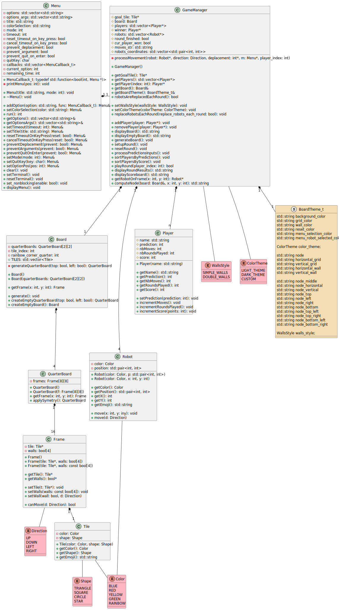

# Doc Folder

## Use case diagram


## Class diagram


## Doxygen

Run this command in main directory to generate doc:
```
doxygen ./doxyfile
```

- [Doxygen_html](./html/index.html)
- [Doxygen_latex](./latex/)